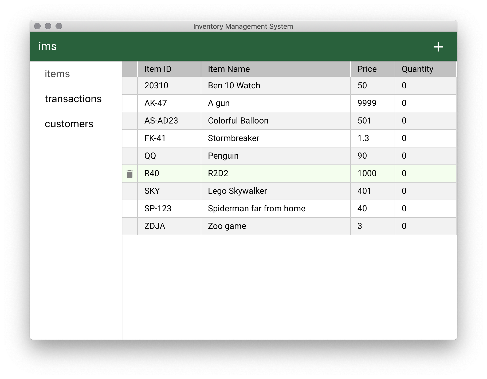

# IMS _Work-in-progress_

An Inventory Management System built using React with Express back-end in an Electron container.

## Current functionalities

- Store data in IndexedDB.
- The main renderer service(User side) can perform CRUD operations through RESTful HTTP requests to the headless renderer service(server).
- Functional Sidebar with choice states(able to store the current chosen option in a React state).
- Display data in HTML Tables.
- HTML Forms + Form Validation.

## TODO

- Expand current HTTP requests to account for more operations + exceptions.
- Move from IndexedDB to MySQL using Sequelize ORM.
- Update model.
- Pagination.
- Searchbar.
- User Authentication.
